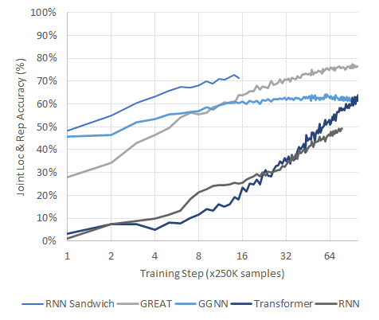

# Global Relational Models of Source Code
This repository contains the data and code to replicate our [ICLR 2020 paper](http://vhellendoorn.github.io/PDF/iclr2020.pdf) on models of source code that combine global and structural information, including the Graph-Sandwich model family and the GREAT (Graph-Relational Embedding Attention Transformer) model.

This repository will also serve as the [*public benchmark*](#benchmark) for any models of source code that address this task on our dataset. Now that the subset of our paper's data that allows public release is available (see [Status](#status)), we will retrain the models described in our work and track both their, and any newly submitted models', performance on this page.

## Quick Start
The modeling code is written in Python (3.6+) and uses Tensorflow (recommended 2.2.x+). For a quick setup, run `pip install -r requirements.txt`.

To run training, first clone the [data repository](https://github.com/google-research-datasets/great) (I recommend cloning with `--depth=1` to save disk-space) and note its location (lets call it `*data_dir*`). Then, from the main directory of this repository, run: `python running/run_model.py *data_dir* vocab.txt config.yml`, to train the model configuration specified in `config.yml`, periodically writing checkpoints (to `models/` and evaluation results (to `log.txt`). Both output paths can be optionally set with `-m` and `-l` respectively.

To customize the model configuration, you can change both the hyper-parameters for the various model types available (transformer, GREAT, GGNN, RNN) in `config.yml`, and the overall model architecture itself under `model: configuration`. For instance, to train the RNN Sandwich architecture from our paper, set the RNN and GGNN layers to reasonable values (e.g. RNN to  2 layers and the GGNN's `time_steps` to \[3, 1\] layers as in the paper) and specify the model configuration: `rnn ggnn rnn ggnn rnn`.

To evaluate the trained model with the highest heldout accuracy, run: `python running/run_model.py *data_dir* vocab.txt config.yml -m *model_path* -l *log_path* -e True` (`model_path` and `log_path` are mandatory in this setting). This will run an evaluation pass on the entire 'eval' portion of the dataset and print the final losses and accuracies.

## Status (07/09/2020)
Update: as of July 9th, 2020, the data has been [released](https://github.com/google-research-datasets/great). I reconstructed the data loading & model running setup today (and fixed some bugs in the [models](#code)) and am currently running the various benchmarks from the paper. There are probably still a few small bugs in the code, but the general setup from the paper works: just modify the architecture(s) in config.yml, especially the model description under `model: configuration` to any configuration as desired (e.g. `great`, `rnn ggnn rnn ggnn`, etc.).

## Data
The data for this project consists of up to three bugs per function for every function in the re-releasable subset of the Py150 corpus, paired with the original, non-buggy code. This data is now publicly available from [https://github.com/google-research-datasets/great](https://github.com/google-research-datasets/great).

Secondly, we will release a real-world evaluation dataset containing bugs found in real Github programs with their descriptors.

## Code
We proposed a broad family of models that incorporate global and structural information in various ways. This repository provides an implementation of both each individual model (in `models`) and a library for combining these into arbitrary configurations (including the Sandwich models described in the paper, in `running`) for the purposes of joint localization and repair tasks. This framework is generally applicable to any task that transforms code tokens to states that are useful for downstream tasks.

Since the models in this paper rely heavily on the presence of "edge" information (e.g., relational data such as data-flow connections), we also provide a library for reading such data from our own JSON format and providing it to the various models. These files additionally contain meta-information for the task of interest in this paper (joint localization and repair), for which we provide an output layer and train/eval optimizer loop. These components are contingent on the data release [status](#status).

## Benchmark
Several models have been benchmarked on this task and dataset; evaluations and submissions of other architectures are strongly encouraged, subject to the [configuration](#configuration) constraints outlined below.

### Results
Representative architectures from each model family have been trained under the constraints below. As time and resources permit, I expect to add several more configurations, especially to assess models with similar parameter budgets. For now, however, the results agree with those in the paper: 

- Plain Transformers take a long time to achieve high accuracy, but show a steady increase towards competitive accuracies;
- GGNNs perform well from very early on, but struggle to achieve much higher accuracy over time;
- RNNs are far behind either, and
- GREAT outperforms GGNNs in a matter of hours, after which it takes a clear lead up to ~85% localization & repair accuracy respectively.
- RNN Sandwich models initially easily beat both GGNNs and GREAT, but saturate sooner than GREAT and thus converge to a lower accuracy (but much higher than plain GGNNs).
- All models retain a decently low false-alarm rate with a no-bug classification accuracy of ~90%

*All accuracies are reported as: joint localization & repair accuracy (the key indicator), bug-free classification accuracy, (bug) localization accuracy, repair accuracy*
| Model (category and variant) | Test Accuracies | Run details: top dev step, time per step, #paramaters  |Hyper-parameters: batch size, learning rate, model shape, etc. |
|---|---|---|---|
|__RNNs__
|2L, 512h    |52.18% (82.57%, 63.56%, 63.22%) |99, 3298s, 9.68M |BS: 12.5K, LR: 1e-4, dropout 0.1 |
|__GGNNs__
|8L, 512h    |65.38% (90.28%, 79.64%, 75.76%) |59, 2170s, 41.19M |BS: 12.5K, LR: 1e-4, steps: [3, 1, 3, 1], residuals: [0: 1+3, 1: 3}], dropout: 0.1 |
|__Sandwiches__
|(1R 4G 1R 4G 1R), 512h |77.98% (88.76%, 86.09%, 85.16%) |95, 6072s, 43.95M |BS: 12.5K, LR: 1e-4, steps: [3, 1], residuals: [0: 1], dropout: 0.1 |
|__Transformers__
|6L, 512h/a  |66.05% (91.70%, 73.39%, 76.79%) |100, 1430s, 26.22M |BS: 12.5K, LR: 1e-4, heads: 8, FF: 2048, dropout 0.1 |
|10L, 512h/a  |71.22% (90.16%, 79.00%, 80.46%) |100, 1936s, 38.82M |BS: 10.0K, LR: 1e-4, heads: 8, FF: 2048, dropout 0.1 |
|__GREAT__
|6L, 512h/a  |78.21% (88.98%, 86.14%, 85.85%) |91, 1534s, 26.23M |BS: 12.5K, LR: 1e-4, heads: 8, FF: 2048, bias_dim: 64, dropout 0.1 |
|10L, 512h/a  |__80.35%__ (89.72%, 87.61%, 87.41%) |100, 1957s, 38.83M |BS: 10.0K, LR: 1e-4, heads: 8, FF: 2048, bias_dim: 64, dropout 0.1 |

Here's a plot of the learning curves (in terms of heldout loc+rep accuracy) of the various models, which closely matches their trajectories in the paper:

### Configuration
The following parameters ought to be held fixed for all models, most of which are set correctly by default in config.yml:

- Each model is trained on 25 million samples (repeating the training data ~14 times) on functions up to 512 tokens (real tokens, not BPE)1.
- The models are evaluated every 250,000 (quarter million) samples on the same 25,000 held-out samples.
- The model with the highest held-out accuracy is tested on the full eval portion of the dataset.
- Every model uses the same shared embedding and prediction layer (averaged sub-token embedding, tentatively up to 10 sub-tokens per token, and two-pointer prediction) and differs only in how the embedding states are transformed into the states used to predict the location and repair by the model.
- The included vocabulary is used, which contains the 14,280 BPE sub-tokens that occur at least 1,000 times in the training data (from tokens no longer than 15 characters).
- Models are trained using the corresponding [dataset](https://github.com/google-research-datasets/great) with millions of Python functions and a wide range of edge types.
- Where possible, all models are run on a single *NVidia RTX Titan GPU* with 24GB of memory. If not the case, this should be noted.2

1: Note that this is substantially larger than the threshold in the paper (250 tokens); this increase is to support generalization to real bugs, which tend to occur in longer functions, and makes little difference in training time on this dataset (average functions span just ~100 tokens).

2: This affects both the timing (of lesser interest), and the batch size, which is strongly dictated by GPU memory and can make a large difference in ultimate performance (which is also why it is explicitly reported).

The following results and variables should be reported for each run:

- The highest *joint localization & repair* accuracy reached in 100 steps (the key metric) on the full 'eval' dataset, using the model that performed highest in this metric on the heldout data at training time. For completeness, please also report the corresponding no-bug prediction accuracy (indicates false alarm rate), bug localization accuracy, and bug repair accuracy (between parentheses).
- *Details pertaining to the run*: the specific step at which that accuracy was achieved, the time taken per step, and the total number of parameters used by the model (printed at the start of training).
- The *hyper-parameters for this model*: at least, the maximum batch size in terms of total tokens (batchers are grouped by similar sample size for efficiency -- users are encouraged to use the default (12,500) for comparability), the learning rate, and any details pertaining to the model architecture (new innovations, with paper, are encouraged!) and its dimensions.